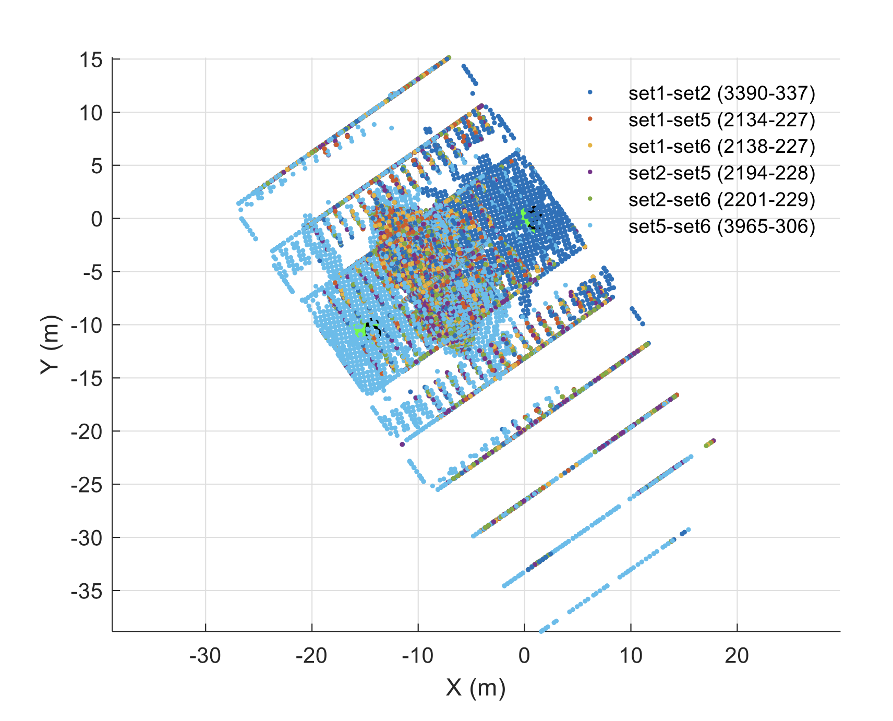
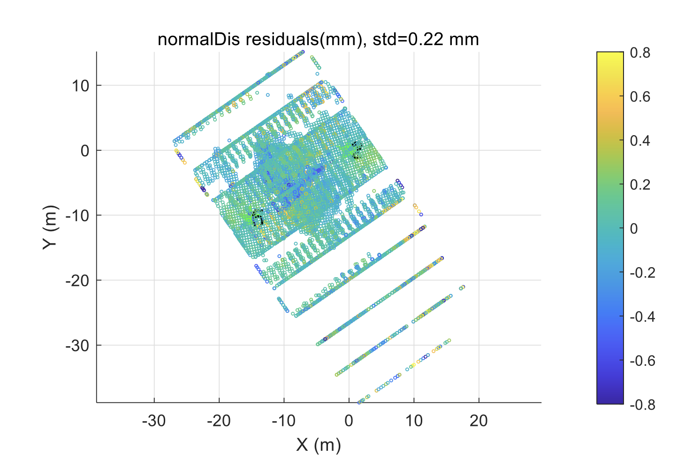

# ScanCal

## Introduction:
This repository contains code for a planar-patch-based TLS self-calibration algorithm, described in the paper: 
**Self-calibration of terrestrial laser scanner using a M3C2-based planar patch algorithm** 
[(link)](https://www.sciencedirect.com/science/article/abs/pii/S0924271623000485). 
The software takes in raw point cloud from a TLS, extracts and weights high-quality planar patches (PPs), 
uses the PPs for scanner calibration model and pose parameter estimation. The output of the software are 
the estimated parameters, their precision, etc. 

The PDF document can be found in [docs](docs/PP%20codes%20document.pdf).

This package has been tested under:

- **MATLAB 2022a** and **MacOS 12.6 M1 Pro**
- **MATLAB 2019a** and **Windows 10**

**[Issues]** If you encounter any issues, I would be happy to help. 
If you cannot find a related one in the existing issues, please open a new one. I will try my best to help!

An overview of the PP-based calibration algorithm is shown in figure 1 below.


 

Fig. 1 Overview of the PP-based scanner calibration algorithm


---
## Usage
### 1.	Project Settings and Data Preparation
The related paths and parameter settings are defined in the script ProjectSettings:
1)	**Paths**: define the base path and result path 
2)	**selfCal**: 
Scanner calibration model related settings, e.g.,

    - 'model' define the to be used scanner calibration model, such as NIST10, NIST8…
    - 'isEvalNISTn' define the index of estimated NIST parameters 
    - 'kap_ref_NISTn' reference values of the parameters
    - 'initNISTn' initial values of the parameters
    - 'sigmaNISTn' a priori variance of the parameters
    
    It should be noted that NIST10 can only be used when scans are from 2 or more stations.
3)	**normDis**: normal distance related settings

The input of the main program scanCalPlane are the raw scan dataset (.mat file for each station containing scanData and metaData). Please refer to the script scanData.m and metaData.m for the definition of scanData and metaData. You may generate such raw dataset yourself according to the definition of scanData and metadata, or use the script loadPtx to transfer a .ptx scan file to the required .mat file.


### 2.	scanCalPlane
scanCalPlane is the main program implementing the PP-based scanner calibration algorithm.  With the program base path (base), result path (result_folder), and other related information (selfCal, normDis) defined in ProjectSettings, we can conduct scanner calibration as follows: 
-	Open the program in its base path, e.g., F:\Codes\ScanCal\' (startup.m runs automatically if matlab is started at the program base path, otherwise, run startup.m manually) 
- 	In command window: 
    -	obj=selfCal();
    -	obj.scanCalPlane();
    -	Choose the data folder in the first pop-up window, e.g., exampleDataset
    -	Choose the datasets to be processed in the second pop-up window, e.g., setup1_24mm_Scan.mat, setup2_24mm_Scan.mat, setup5_24mm_Scan.mat, setup6_24mm_Scan.mat. 
    
        For this exemplary dataset, setup1 & 2 are two face scans from the same station, setup5&6 are two face scans from another station.

Then, the program will run automatically to do scanner calibration. The users are referred to Fig 1 and comments within the codes for the processing details. The estimated parameters and their accuracy will be output in the command window, files, and plots. The figures below show the plots generated by the program using the exemplary dataset.

 

Figure 2. Distribution of the extracted PPs. set1-set2(3390-337) represents PPs identified between point clouds of setup1 and setup2, 3390 PPs with an average number of 337 points on each PP, the other denotations have the similar meaning.


 

Figure 3. Residuals of the normal distances in the last iteration of scanner calibration


 


 
Figure 4. Estimated parameters with the PP calibration algorithm. Top: NIST10 model parameters, bottom: pose parameter corrections of the three scans

---

## Cite ScanCal
Thank you for citing our PP-based TLS calibration paper if you use any of this code:

```
@article{qiao2023self,
  title={Self-calibration of terrestrial laser scanner using a M3C2-based planar patch algorithm},
  author={Qiao, Jing and Butt, Jemil Avers},
  journal={ISPRS Journal of Photogrammetry and Remote Sensing},
  volume={197},
  pages={335--345},
  year={2023},
  publisher={Elsevier}
}
```

---

## Acknowledgements:
Apart from the ones thanked in the above mentioned paper, we sincerely thank the group of Geo Tu Wien for sharing 
their point cloud processing tool http://www.geo.tuwien.ac.at/downloads/pg/pctools/pctools.html, 
which makes our work more efficient. 

Thanks also goes to Dr. Medic Tomislav for his codes on global test.


